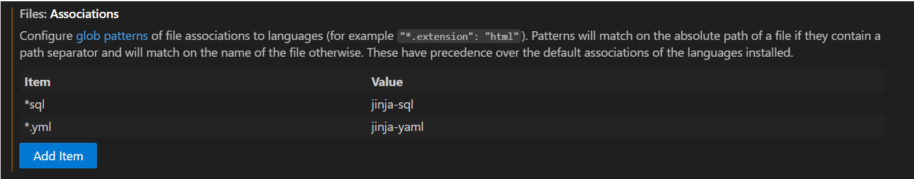

**[dbt docs Pages](https://dox69.github.io/dbt-projects)** ← **LIEN PRINCIPAL**
# Summary of local setup steps

### Prérequis
- uv
- Python <= 3.10
- Git
- Databricks workspace + token
- VS Code
### Technical stack

| Composant | Outil | Version | Raison |  
|-----------|-------|---------|--------|  
| **Data Warehouse** | Databricks | free edition | Scalable, SQL + Spark |  
| **Transformations** | dbt Core | 1.8.0+ | Modulaire, testable, lineage |  
| **Source Control** | Git + GitHub | - | CI/CD intégré |  
| **Dashboard** | Streamlit | 1.40.0+ | Rapide à itérer, Python-native |  
| **Data Processing** | Pandas | 2.2.0+ | Transformations légères, caching |  
| **Visualisations** | Plotly | 5.22.0+ | Graphiques interactifs |  
| **Tests** | pytest | 8.4.0+ | Tests unitaires |  
| **CI/CD** | GitHub Actions | - | Workflows gratuits |  

### Installation

```bash
# 1. Cloner
git clone https://github.com/DOX69/dbt-projects.git
cd dbt-projects

# 2. create virtualenv using uv
uv init
uv sync
# Windows

# 3. install dependencies
pip install -r requirements.txt

# 4. Configure dbt
# Create ~/.dbt/profiles.yml with your Databricks credentials
# (see section "Setup Databricks connection" below)
# Each time you run dbt command, make sure your venv is activated and use cd dbt_shop_report to go to the right directory.
cd dbt_shop_report
# 5. connexion test
dbt debug

# 6. Build project
dbt deps                          # download dependencies
dbt build --target dev            # Dev environment
dbt build --target prod           # Prod environment (optionnal)

# 7. Doc generation
dbt docs generate
# and open dbt_project/target/index.html
```

### Setup Databricks connection

Create `~/.dbt/profiles.yml` :

```yaml
dbt-projects:
  outputs:
    dev:
      type: databricks
      host: adb-[ACCOUNT-ID].databricks.com
      http_path: /sql/1.0/endpoints/[ENDPOINT-ID]
      token: [YOUR-TOKEN]
      schema: [YOUR-DEV-SCHEMA]
      catalog: dev
      threads: 1

    prod:
      type: databricks
      host: adb-[ACCOUNT-ID].databricks.com
      http_path: /sql/1.0/endpoints/[ENDPOINT-ID]
      token: [YOUR-TOKEN]
      schema: [YOUR-PROD-SCHEMA]
      catalog: prod
      threads: 1

  target: dev
```
Copy C:\Users\<your_user>\.dbt\profiles.yml to the your project name directory (dbt_shop_report/) and in .gitignore, add it (`profiles.yml`) 
# Project structure :
```
dbt-projects/dbt_shop_report/
├── README.md                          # ← This file
├── requirements.txt                   # ← dependencies python
├── dbt_project.yml                    # ← Config dbt
├── profiles.yml                       # ← GITIGNORE (secrets)
├── .gitignore                         # ← Ignore profiles.yml and other files
│
├── models/
│   ├── source/
│   │   ├── sources.yml               # ← Source definitions
│   │
│   ├── silver/
│   │   ├── fact_customer_sales_enriched.sql
│   │   ├── fact_sales_product_enriched.sql
│   │   └── properties.yml
│   │
│   └── gold/
│       ├── agg_customer_loyalty.sql
│       └── agg_sales_product_payment.sql
│
├── models/
│   └── scd2.yml                     # ← Snapshot models for dim (SCD2)
├── tests/
│   ├── generic/
│   │   └── non_null_negative.sql
│   ├── gross_amount_equal_price_x_quantity.yml
│   └── null_negative_net_amount.sql
│
├── macros/
│   └── generate_schema.sql          # ← Jinja macro
│
├── .streamlit/
│   ├── config.toml
│   └── secrets.toml                   # ← GITIGNORE (secrets)
│
├── app/                               # ← Streamlit dashboard
│   ├── app.py                         # ← Main file
│   ├── utils_databricks.py            # ← Connection + data loading
│   ├── utils_transformations.py       # ← Aggregations (Pandas)
│   └── requirements.txt
│
├── scripts/                           # ← Utilitaires
│   └── test_databricks_connection.py
│
└── .github/
    └── workflows/
        ├── dbt-docs-ci.yml            # ← Generate + publish docs
        └── test-app.yml               # ← Test Streamlit app
```

## Implemented best practices

### Code Quality
-  Norme dbt (models, tests, descriptions)
-  Column-level documentation
-  Clear naming conventions (fact_, dim_)
-  Primary keys + uniqueness tests

### Testing
-  dbt built-in tests (not null, unique, relationships, accepted_values)
-  Custom tests for business logic
-  pytest for Python code
-  CI/CD runs tests automatically


### DevOps
-  Version control (Git)
-  CI/CD automation (GitHub Actions)
-  Infrastructure as code (profiles.yml)
-  Secret management (.gitignore)

### Documentation
-  dbt docs auto-generated
-  GitHub Pages hosting
-  Column-level comments
-  Model lineage

---

## Useful resources

- **dbt Docs** : https://docs.getdbt.com/
- **Databricks SQL** : https://docs.databricks.com/sql/
- **Streamlit Docs** : https://docs.streamlit.io/
- **GitHub Actions** : https://docs.github.com/actions

---

# Intallation (for developers):
- VS code
- Install git
- Create databricks free edition account
- Python 3.9 (Don't forget to add python.exe to PATH during installation)
- uv
## Init uv
After creating a new project in PyCharm from .venv python 3.9, run :
```PowerShell
uv init
uv sync
```
## Install dbt-core and databricks adapter
```PowerShell
uv add dbt-core dbt-databricks
```
Note: if you want to have the current required packages txt file, run : `uv pip freeze > requirements.txt` 
## Init dbt
```PowerShell
dbt init
```
- Give it an explicit name.
- Here we are using [1] databricks, so enter 1.
- Past your host : databricks UI > compute > SQL warehouse > [click on compute name you want to use] > Connection details > [Copy and past the Server hostname]
- Same as previous step for http_path
- Enter 1 and create access token : settings > developer > Access Token > manage > [Generate access token] > Paste it using ctrl+V ,**it will show nothing, it's normal, but the token is there don't worry** > [click on enter]
- Enter 1 to use unity Catalog and provide catalog name and schema name you want to use  
- Copy C:\Users\<your_user>\.dbt\profiles.yml to the your project name directory (dbt_shop_report/) and in .gitignore, add it (`profiles.yml`)  
**Test the connection:**  
```PowerShell
cd <project_name>
dbt debug
```
You will notice that there is an error : ` dbt_project.yml file [ERROR not found]`.  
Just go to the right directory using `cd <project_name>` command to resolve it.  

If you have other error like invalid access token, rerun `dbt init` **inside the project you want to overwrite** and try again.

Sometimes Windows is blocking the activation script for your virtual environment because of PowerShell’s execution policy. You need either to relax the policy (ideally just for your user or the current shell) or use an alternative shell. In that case, you will have an error when activate you virtual environment. To fix this, run :
```PowerShell
Set-ExecutionPolicy -Scope Process -ExecutionPolicy Bypass
. C:\Users\<your_user>\<full_path_directory_to_your_project>\.venv\Scripts\Activate.ps1
```
Then restart terminal.

## Extentions for VS code
Add `Power User for dbt`extension and in the settings, search for `@id:files.associations` and associate file type :  


## dbt begin guide :
[README dbt project](/dbt_shop_report/README.md)

---

## 📞 Support

For questions or support, please open an issue on GitHub or contact me on linkedin directly.

---

## Licence

MIT License – Free to use.

---